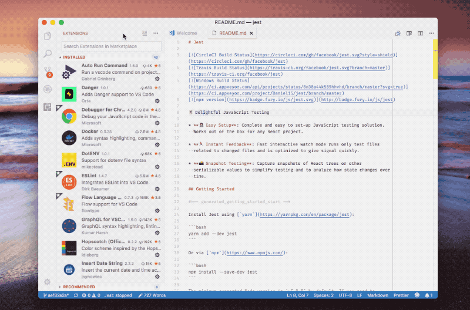

# Frequently Asked Questions

If you have a question that is not listed below, please <a href="mailto:wcandillon@gmail.com">contact us</a>.

## Is React Native the right technology for me?

Yes.

More seriously 😀, we are obviously big React Native fans. We strongly believe that both the React development model and the approach used by React Native disrupt the economics of building and distributing mobile applications. We wrote about this topic [here](https://hackernoon.com/the-80-20-of-react-native-10f2b6af663). We are also excited with the roadmap for both [React](https://reactjs.org/blog/2018/03/01/sneak-peek-beyond-react-16.html) and [React Native](https://facebook.github.io/react-native/blog/2018/06/14/state-of-react-native-2018).

Companies that have substantial budgets for their mobile development teams might have a different take on React Native since they can afford native developments. We found the following stories on medium to be extremely interesting.

* [Why Discord is Sticking with React Native](https://blog.discordapp.com/why-discord-is-sticking-with-react-native-ccc34be0d427)
* [React Native at Airbnb](https://medium.com/airbnb-engineering/react-native-at-airbnb-f95aa460be1c)

## Is Expo the right technology for me?

Yes.

If you are building a React Native project, Expo is a must have tool. It packages the best native modules from the community such as [react-native-maps](https://github.com/react-community/react-native-maps) and [react-native-svg](https://github.com/react-native-community/react-native-svg) as well as contributing high quality libraries that can only be found in ExpoKit: [Filesystem API](https://docs.expo.io/versions/latest/sdk/filesystem), [Video API](https://docs.expo.io/versions/latest/sdk/video), and [Audio API](https://docs.expo.io/versions/v29.0.0/sdk/audio) just to name a few.

If your app dependencies just depend on ExpoKit, you can have your entire development process done from start to App Store publication without even opening XCode or Android Studio. [Expo will build the app binaries for you](https://docs.expo.io/versions/latest/guides/building-standalone-apps.html).

If you do have other native dependencies in your app, Expo is still incredibly useful. First of all, you will benefit from all the high quality modules that we mentioned above. Secondly, expo  provide a convenient way to distribute [updates over the air](https://docs.expo.io/versions/latest/guides/configuring-ota-updates) as well a way to setup [different distribution channels](https://docs.expo.io/versions/latest/distribution/release-channels).

You can also checkout this [great article](https://medium.com/appandflow/yes-you-should-start-your-react-native-project-with-expo-9fbfb20d1f99) on the topic.

## I love this starter kit but I'm not very pro-efficient with React Native. How should I train my React Native skills?

First things first, you need to be efficient with React. A great way to start is the official [React documentation](https://reactjs.org/docs/getting-started.html). You also should target some level of proficiency with Flexbox. We often refer to [this cheatsheet](https://css-tricks.com/snippets/css/a-guide-to-flexbox/) as well as the [React-Native-specific Flexbox documentation](https://facebook.github.io/react-native/docs/flexbox) while writing React Native code. The official [React Native documentation](https://facebook.github.io/react-native/docs/getting-started) is a must read as well. We use [react-navigation](https://reactnavigation.org/) and this project is well documented, we recommend that you check it out too.

YouTube is full of high-quality tutorials about modern JavaScript codebases, as well as React Native tutorials. There are also paid options like Udemy that seem to be popular. Our personal recommendation is to learn by doing. Set a goal and stackoverflow your way to achievement 🏆.

## How to I start a seed project from this starter kit?

Good question 😊. Please refer to this [documentation page on building a Seed project](BuildingASeedProject.md).

## When buying React Native Elements, how will I be updated? And how can I report issues?

Once you acquire React Native Elements please <a href="mailto:wcandillon@gmail.com">send us your Github username</a>. We will grant you access to the repository where the starter kit is develop and you will get notified for every update. You will also be able to use the Github issues to ask questions and report potential issues. As of the time of writing, Elements has more than two hundred customers that form an interesting group of React Native developers ready to help each others.

## How can I see what's inside the starter kit?

Most of React Native Elements was coded live on YouTube. You can checkout all the video [here](https://www.youtube.com/playlist?list=PLkOyNuxGl9jyqOeRZrKKSaUu0c49ZhPmn).
Below are a couple of examples:
* [Going from Sketch to React Native & Theming in React Native](https://www.youtube.com/watch?v=1Ol0N71b21c)
* [Instagram filters and Image editing in React Native](https://www.youtube.com/watch?v=AMAJLgafs6U&index=4&list=PLkOyNuxGl9jyqOeRZrKKSaUu0c49ZhPmn)
* [Using React Native Sketch Elements Components](https://www.youtube.com/watch?v=d1FBpEl7EE8&t=12s&list=PLkOyNuxGl9jyqOeRZrKKSaUu0c49ZhPmn&index=8)
* [Travel Guide - React Native Sketch Elements](https://www.youtube.com/watch?v=ryid9u15NYA&index=1&list=PLkOyNuxGl9jyqOeRZrKKSaUu0c49ZhPmn)

## How to wire a backend to this kit?

At the moment we do not provide a backend integration but we do have some video tutorials to support you in this process.
If you are starting from scratch, we recommend to use Firebase since it supports most mobile use cases from authentication, database, storage, and way more (cloud functions, deep linking, analytics, and so on). We have integrated Firebase to an existing starter kit and recorded the process on Youtube:

* [Firebase Authentication](https://www.youtube.com/watch?v=0TlOhmdl3-M)
* [Cloud Firestore Queries](https://www.youtube.com/watch?v=gLStsQMWrrA)
* [Cloud Firestore Transactions](https://www.youtube.com/watch?v=mQKEAo4YnNU)

If you are using a non-Firebase backend, and your service consist of a REST API that needs to be consumed, these video might still be useful, especially the part about authentication.

## Which IDE should I use?

There are two great free IDE for React Native development: [Atom IDE](https://ide.atom.io/) from Facebook and [Visual Studio Code](https://code.visualstudio.com/) from Microsoft. For paid options, [WebStorm](https://www.jetbrains.com/webstorm/) from JetBrains seems to be the most popular option.

### Extra errors when using Visual Studio Code

To develop React Native Elements with Visual Studio, we recommend adding a flow extension such as [this one](https://github.com/flowtype/flow-for-vscode). You also need to set `javascript.validate.enable` option to false or completely disable the built-in TypeScript extension for your project (see gif below):

## How do I get my existing React Native project running with Expo?

If you are looking to use these components into an existing project that doesn't have a dependency with Expo Kit, please refer to [the official Expo documentation on this topic](https://docs.expo.io/versions/latest/introduction/faq#how-do-i-get-my-existing-react).
